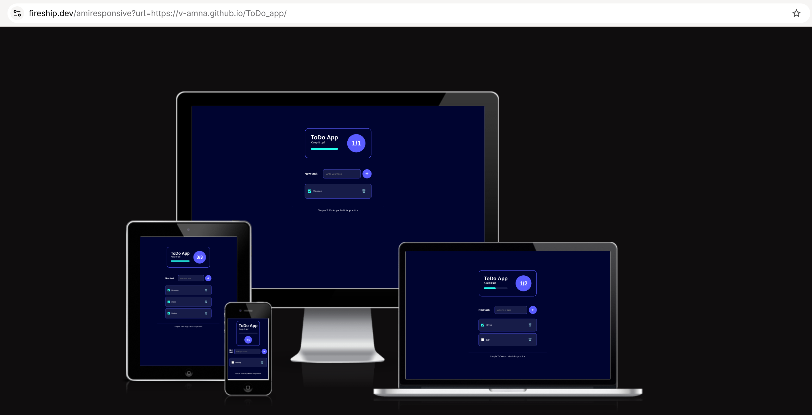
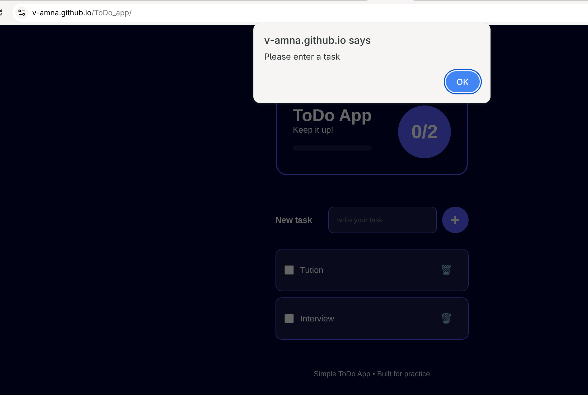
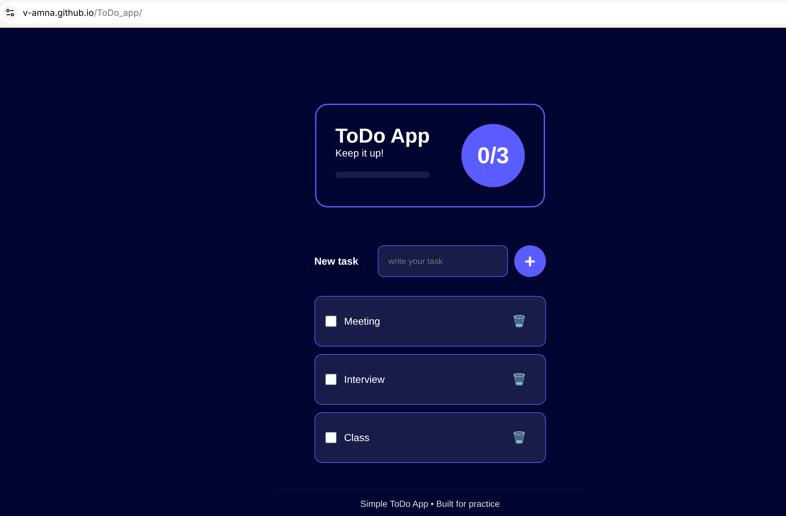
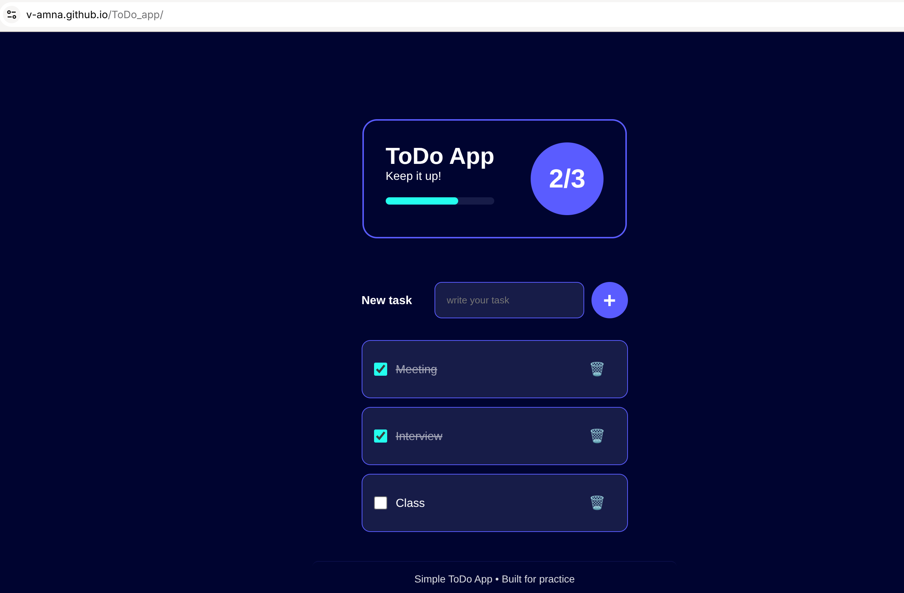
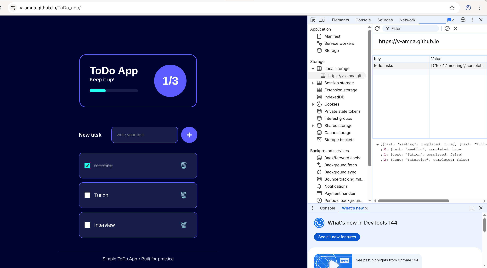
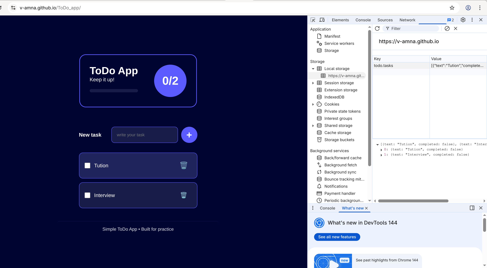
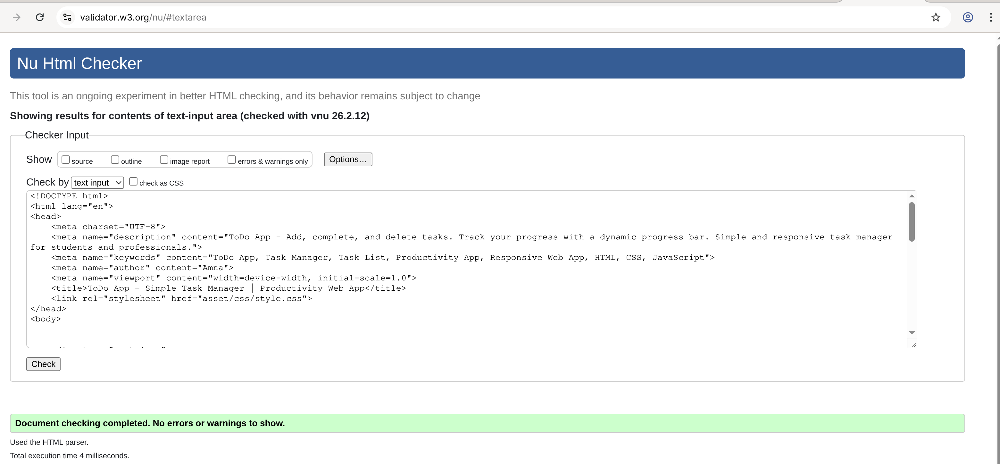
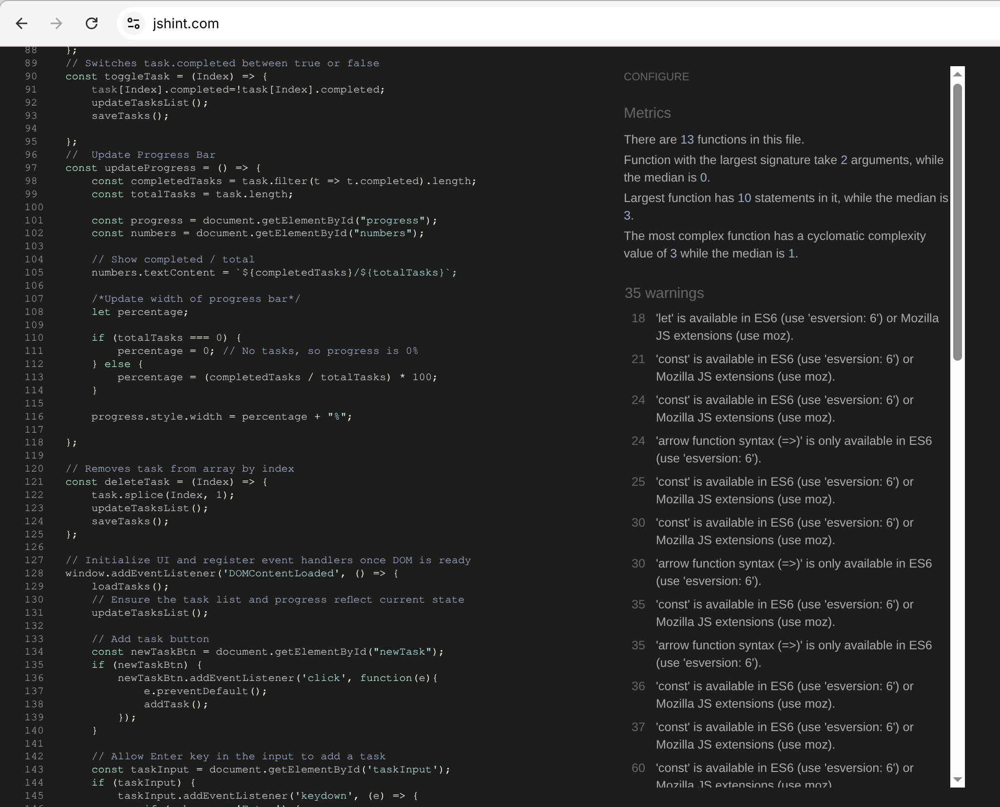
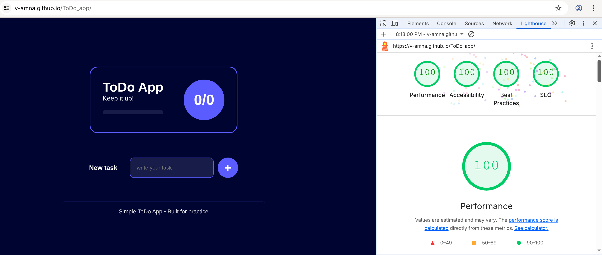
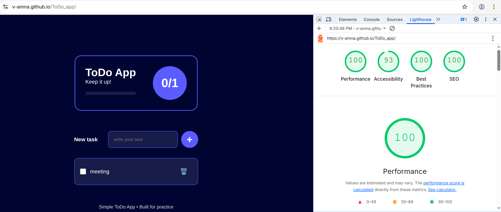

# ToDo App – Task Management Web Application

## Project Overview

The ToDo App is a simple, responsive task management web application designed to help users organise their daily activities efficiently. The application allows users to add tasks, mark them as completed, and delete tasks when no longer required. A dynamic progress bar visually represents the number of completed tasks, encouraging productivity and goal tracking.

This project was developed as part of my web development learning journey using HTML, CSS, and JavaScript. The focus was on creating a real-life usable application with clear user interaction, accessibility, responsive design, and clean, well-documented code.

## Project Goals
- Build a fully functional interactive web application.
- Implement task creation, updating, and deletion.
- Ensure accessibility, responsiveness, and usability.
- Follow best practices for HTML, CSS, and JavaScript.

## Target Audience
- Students managing daily study tasks
- Beginners learning productivity habits
- Users who want a lightweight, browser-based task manager

##  Features

### Add Tasks
- Users can enter a task using the input field
-  Input validation prevents empty tasks from being added

- Tasks are instantly displayed in the task list

### Update Tasks
- Each task includes a checkbox
- Checking the box marks the task as completed
- Completed tasks are visually updated with a line-through style
- Completed tasks are visually updated with a line-through style

### Delete Tasks
- The task list and progress bar update immediately after deletion
- Click 🗑 to remove

### Auto-save 
- All tasks persist in browser localStorage `application->local storage`
- loadTasks() – Reads saved tasks from localStorage on page load
- saveTasks() – Writes the task array to localStorage after every   change

### Progress bar 
-  Shows how many tasks are completed
How It Works
- Display Format: completed/total (e.g., 0/3, 2/5)
- Left number = Tasks you've checked off 
- Right number = Total tasks in your list
- Progress bar = Visual percentage of completion
   

## Features to Implement
- Add confirmation before deleting a task
- User authentication for personalised task lists
- Dark/Light theme toggle

##   Testing

- W3C HTML Validator
  

- Jigsaw Validator
  

- JavaScript Validation
  

- Accessibility Testing
  

  

## Unfixed Issues
- No known unfixed bugs at the time of submission

## Deployment(GitHub Pages)
- Create a gitHub Repositery
- Push project files using Git
- Navigate to Repositery -> Settings
- Select Pages
- Choose 'main' branch as the source.
- save and wait for github generate live link
The project accessible via the GitHub Pages deployment link.
## Media

 Icons used: Emoji icons (🗑, ✔)
 No external images or copyrighted media used

## Technologies Used

- **HTML5** - Semantic markup structure
- **CSS3** - Modern styling with CSS variables and Flexbox
- **JavaScript** - Core functionality and DOM manipulation

## Tools
- Git & GitHub
- Lighthouse
- W3C Validators

## Credits
 ### Content
- Code institute learning metrials
- Javascript Tutorial
- random public reference

